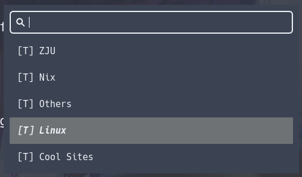
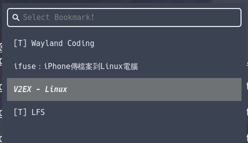
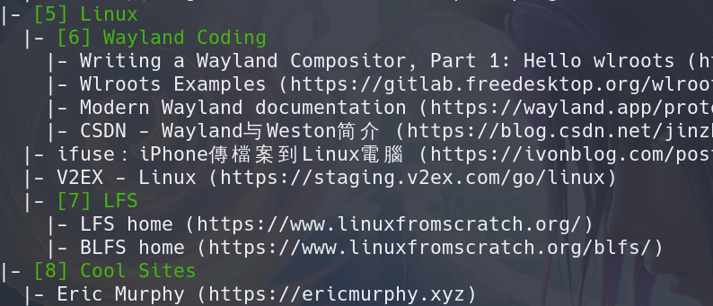

# 🌐FuzzyMarks🔎

## Intro

This project is a bookmark management system that allows you to quickly search and open bookmarks using popular fuzzy finders on Linux, such as [**dmenu**](https://tools.suckless.org/dmenu/), [**rofi**](https://github.com/davatorium/rofi), or [**wofi**](https://sr.ht/~scoopta/wofi/). Bookmarks are stored in a hierarchical structure within `bookmarks.json`, and users can customize settings through `config.json`. Additionally, a command-line tool is provided to easily add or remove bookmarks or bookmark folders.

## Feature

### 1. **Bookmark Selector (`bookmarks-selector.py`)**  
- Quickly search for bookmarks using a fuzzy finder.  
- Open selected bookmarks with the browser specified in the user configuration.  
- Supports user-defined paths for bookmark and configuration files.  
- If no bookmark is selected and the user presses **Enter** after typing custom text, the script will perform a web search using the search engine URL specified in `config.json`. The input text will be appended to the search URL, providing a seamless search experience.

### 2. **Bookmark Editor (`bookmarks-editor.py`)**  
- Provides a command-line interface for adding or removing bookmarks and bookmark folders.  
- Allows users to manage bookmarks and folder hierarchy with ease.

## Outputs



## Requirement
- [**Python** (>=3.5)](https://www.python.org/)
- **Fuzzy finder** ([dmenu](https://tools.suckless.org/dmenu/), [rofi](https://github.com/davatorium/rofi), [wofi](https://sr.ht/~scoopta/wofi/) ...)

## Default Paths

- **Configuration file (`config.json`)**: `~/.config/project-name/config.json`
- **Bookmark file (`bookmarks.json`)**: `~/.config/project-name/bookmarks.json`

> **Tip:** Sample configuration and bookmark files are provided in the project. You can copy them to the default directory as follows:  
> ```bash
> mkdir -p ~/.config/FuzzyMarks
> cp config.json ~/.config/FuzzyMarks/
> cp bookmarks.json ~/.config/FuzzyMarks/
> ```

## Usage

### 1. **Bookmark Selector (`bookmarks-selector.py`)**

Quickly search for bookmarks using a fuzzy finder and open them in your browser.  
You can also type text and use your configured search engine to start a search 🌏. Just type your text and press Enter!

#### **Run Command**

```bash
python3 bookmarks-selector.py [options]
```

#### **Options**

| Option                  | Description                          | Default Path                         |
|-------------------------|--------------------------------------|--------------------------------------|
| `-b [path]`              | Specify the path to the bookmark file | `~/.config/project-name/bookmarks.json` |
| `-c [path]`              | Specify the path to the config file   | `~/.config/project-name/config.json`    |
| `-h`, `--help`           | Display help information             |                                      |

---

### 2. **Bookmark Editor (`bookmarks-editor.py`)**

A command-line tool for managing bookmarks and bookmark folders.

#### **Run Command**

```bash
python3 bookmarks-editor.py [options]
```

#### **Options**

| Option                   | Description                           |
|--------------------------|---------------------------------------|
| `add_bookmark [parent_folder] [name] [url]` | Add a bookmark `name` with `url` to `parent_folder` |
| `del_bookmark [folder] [name]` | Delete bookmark `name` in `folder` |
| `add_folder [parent_folder] [name]` | Add folder `name` to `parent_folder` |
| `del_folder [folder]` | Delete `folder` |
| `-p [path]`, `--path [path]` | Specify the path to the bookmark file (default: ~/.config/FuzzyMarks/bookmarks.json)|
| `print` | print all bookmarks and folders in tree structure |
| `-h`, `--help` | Display help information |

#### Examples

##### Print all bookmarks

```bash
python3 bookmarks-editor.py print
```

- Bookmarks and folders will show in your terminal
- Folders are in <span style="color:green">GREEN</span>!
- `Folders' ID` = the number in front of their name




##### Add a Bookmark
```bash
python3 bookmarks-editor.py add_bookmark 0 "Hello, Github!" https://www.github.com
```
- Add bookmark "Hello, Github"(https://www.github.com) to folder `"0"`. 
> Add Github to folder `"0"` : like adding Github to your web browser bookmarks tab

##### Delete a Bookmark
```bash
python3 bookmarks-editor.py del_bookmark 0 "Hello, Github"
```
- Delete bookmark "Hello, Github!" from folder `"0"`

##### Add a Bookmark folder
```bash
python3 bookmarks-editor.py add_folder 1 "Linux"
```
- Add folder "Linux" to folder `"1"`
> The script will generate a non-use ID for your new folder

##### Delete a Bookmark folder
```bash
python3 bookmarks-editor.py del_folder 7
```
- Delete folder `"7"`

## Configuration File (`config.json`)

An example `config.json` file:

```json
{
  "browser-open-cmd": "qutebrowser",
  "dmenu-cmd": "wofi --show dmenu",
  "dmenu-title-arg": "--prompt",
  "dmenu-extra-arg": "",
  "title-content": "Select Bookmark!",
  "head-for-page": "",
  "head-for-folder": "[T] ",
  "search-engine-parh": "https://google.de/search?q="
}
```

| Setting                | Description                                                                                           |
|------------------------|-------------------------------------------------------------------------------------------------------|
| `browser-open-cmd`      | The command to open bookmarks in your browser.                                                         |
| `dmenu-cmd`             | The command to launch the fuzzy finder tool for selecting bookmarks.                                  |
| `dmenu-title-arg`       | The parameter needed to show text in dmenu (like a placeholder, or the menu title).                   |
| `dmenu-extra-arg`       | Extra arguments or options to customize how the fuzzy finder works.                                   |
| `title-content`         | Custom text that you want to show in dmenu (like a placeholder or the menu title).                    |
| `head-for-page`         | The text that can appear before options that are for pages.                                            |
| `head-for-folder`       | The text that can appear before options that are for folders.                                          |
| `search-engine-path`    | The full URL path of the search engine used for direct searches.                                      |

You can simply remove any of the above options from `config.json` if you don't need them. The script will use the default options.


**Example of Direct Web Search:**  
If you type `How to fly` and presses **Enter** without selecting a bookmark, the script will open:  
```
https://www.google.com/search?q=how+to+fly
```

## Understanding the `bookmarks.json` File

> **Notice**:  
> Unless you're familiar with the structure, it's best not to manually edit the `bookmarks.json` file. Instead, use the provided `bookmarks-editor.py` script to safely add, remove, or modify bookmarks and folders.

### Fields

The `bookmarks.json` file used in this project follows a structure that combines both folders and pages, and each entry is represented by two fields: `url` and `next`. Here’s how these fields work:

1. **`url` Field:**
    - For **pages**, the `url` field contains the actual URL of the webpage.
    - For **folders**, the `url` field is irrelevant and does not contain a real URL. It’s generally left as an empty string (`""`).

2. **`next` Field:**
    - For **pages**, the `next` field has a fixed value of `-1`, since pages do not have sub-items.
    - For **folders**, the `next` field refers to the ID of the next folder in the structure, allowing the program to recursively print and display the folder tree.

### Folder Structure

The structure in `bookmarks.json` is hierarchical, where folder IDs (`0`, `1`, `2`, etc.) can contain other folders or pages as sub-items. For example:
- Folder `0` is the root folder, which contains several subfolders like `1`, `2`, and `3`.
- Folder `1` contains various pages (like `Google`, `Baidu`, etc.), each with a `url` and `next` value of `-1`.

### Example

```json
{
  "0": {
    "Favorites": {
      "url": "",
      "next": "1"
    },
    "Work": {
      "url": "",
      "next": "2"
    }
  },
  "1": {
    "Google": {
      "url": "https://www.google.com",
      "next": "-1"
    },
    "Github": {
      "url": "https://www.github.com",
      "next": "-1"
    },
    "Tech News": {
      "url": "",
      "next": "3"
    }
  },
  "2": {
    "NixOS Docs": {
      "url": "https://nixos.org/manual",
      "next": "-1"
    },
    "Linux Forum": {
      "url": "https://www.linux.org/forums",
      "next": "-1"
    }
  },
  "3": {
    "Hacker News": {
      "url": "https://news.ycombinator.com",
      "next": "-1"
    },
    "TechCrunch": {
      "url": "https://techcrunch.com",
      "next": "-1"
    },
    "Stack Overflow": {
      "url": "https://stackoverflow.com",
      "next": "-1"
    }
  }
}
```

#### Example Explanation:
- **Root folder (ID `0`)** has two subfolders: `Favorites` and `Work`.
- **Folder `1` (Favorites)** contains pages: `Google`, `Github`, and a subfolder `Tech News` (ID `3`).
- **Folder `3` (Tech News)** contains pages: `Hacker News`, `TechCrunch`, and `Stack Overflow`.
- **Folder `2` (Work)** contains pages: `NixOS Docs` and `Linux Forum`.

#### Example Visualization:

```
Favorites
├── Google (https://www.google.com)
├── Github (https://www.github.com)
└── Tech News
    ├── Hacker News (https://news.ycombinator.com)
    ├── TechCrunch (https://techcrunch.com)
    └── Stack Overflow (https://stackoverflow.com)
Work
├── NixOS Docs (https://nixos.org/manual)
└── Linux Forum (https://www.linux.org/forums)
```

## Help Information

Both scripts (`bookmarks-selector.py` and `bookmarks-editor.py`) support the `-h` or `--help` options to display detailed usage information:

```bash
python3 bookmarks-selector.py -h
python3 bookmarks-editor.py --help
```

## Contribution

Contributions are welcome! Feel free to submit issues and pull requests to improve this project. 😄

## License

This project is licensed under the MIT License.
